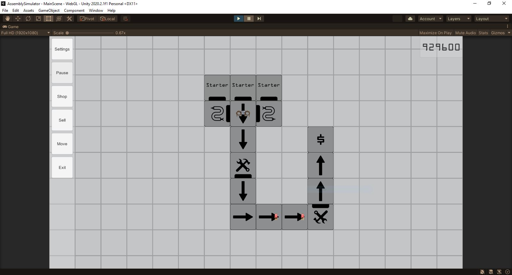
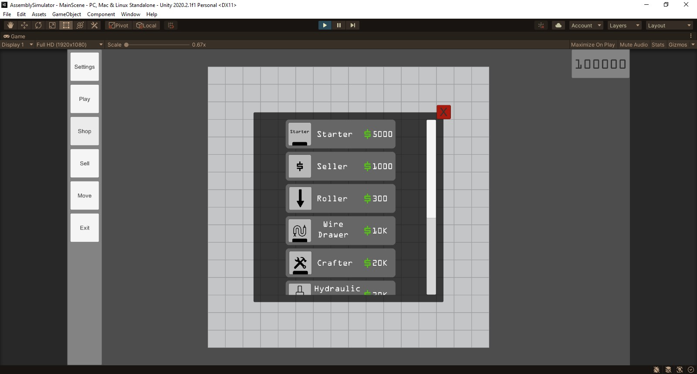
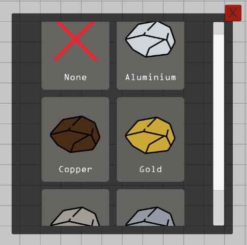
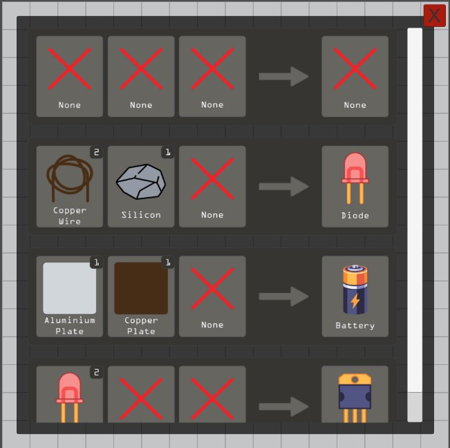

# Assembly Simulator

## Project review

The application is a simulator of the production line in a plant. At the user's disposal are presented six devices with completely different functionalities and four with a partially similar behavior, but with some peculiarities. Having a set of five types of raw materials, through their processing and / or combination, thirteen new ones are obtained. The organizational logic of the application allows easy completion of the list of elements that can be obtained after simulating the processing and production processes.

## Commands

- Camera move: move your mouse to one of the screen edges or use (W, A, S, D) keys.
- Camera zoom: use your mouse scroll.
- Camera lock: press the 'C' key.

## Screens

